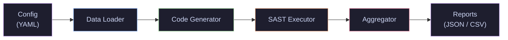

# Product Requirements Document
## LLMSecEvalPipeline, Automated Security Evaluation of LLM-Generated Code

| Field | Value |
|---|---|
| **Author** | Steven Shi (s.shi.2) |
| **Supervisors** | Dr. Olga Gadyatskaya & Shuang Sun |
| **Institution** | LIACS, Leiden University |
| **Date** | 2026-04-22 |
| **Version** | 1.0 |
| **Repository** | `D:\School\BThesis\LLMSecEvalPipeline` |

---

## 1. Purpose & Motivation

### 1.1 Problem Statement

LLM-generated code frequently contains security vulnerabilities, yet no widely available **modular, reproducible pipeline** exists that allows researchers to:

- Swap LLMs (local or API-based) without re-engineering.
- Swap static analysis tools without re-engineering.
- Reproduce results across different prompt datasets.
- Compare vulnerability profiles across models, tools, and prompt categories.

### 1.2 Product Vision

Build **LLMSecEvalPipeline**, a CLI-driven, modular Python pipeline that:

1. Loads and preprocesses prompt datasets.
2. Generates code from those prompts using configurable LLMs.
3. Runs configurable SAST (Static Application Security Testing) tools on the generated code.
4. Aggregates, computes metrics, and exports structured results.

### 1.3 Research Question Served

> *To what extent does code generated by a large language model contain detectable security vulnerabilities when evaluated using automated static analysis across a structured dataset of programming prompts?*

### 1.4 Thesis Contributions Mapped to Product

| Contribution | Pipeline Component |
|---|---|
| (1) Modular, reusable pipeline | Entire system architecture |
| (2) Empirical study (DeepSeek + Bandit) | Default configuration & first full run |
| (3) Quantitative insights | Aggregator output & analysis notebooks |

---

## 2. Scope

### 2.1 In Scope (MVP, Thesis Deliverable)

| Area | Details |
|---|---|
| **Prompt dataset** | DevGPT dataset (ChatGPT shared conversations); English-only filter via `lingua`; min 10-char filter |
| **Code generation** | DeepSeek-R1-0528-Qwen3-8B (GGUF Q4_K_XL) served via Ollama, local GPU inference |
| **Static analysis** | Bandit v1.9.4 (Python) |
| **Metrics** | Prevalence (ατ), Proportion (βτ), CWE distribution, Severity distribution, MITRE Top-25 overlap |
| **Output** | JSON results, CSV summary tables, console reports |
| **Reproducibility** | Deterministic seeding, full config export, open-source release |

### 2.2 Out of Scope (Future Extensions)

- Additional LLMs (GPT-4, CodeLlama, etc.), architecture must **support** them but they won't be run.
- Additional SAST tools (Semgrep, CodeQL), architecture must **support** them but only Bandit is implemented.
- Languages other than Python.
- Web UI / dashboard.
- Dynamic analysis or runtime testing.

---

## 3. System Architecture



### 3.1 Design Principles

| Principle | Rationale |
|---|---|
| **Modularity** | Each stage is an independent module with a defined interface; swapping a model or tool requires implementing one adapter class. |
| **Reproducibility** | Every run is fully described by a YAML config + Git SHA. Random seeds are fixed. |
| **Resumability** | Each stage persists its output; a crashed run resumes from the last completed stage. |
| **Isolation** | Generated code is never executed, only statically analyzed. |

---

## 4. Module Specifications

### 4.1 Data Loader

**Responsibility:** Load raw prompts, apply filters, output a clean prompt list.

#### Input
- DevGPT snapshot JSON files (e.g., `*_sharing.json` containing `ChatgptSharing` objects) from `Dataset/` directory.

#### Processing Steps
1. **Load and extract** prompts from DevGPT JSON files. Parse each file, iterate through `ChatgptSharing` and their `Conversations`, and extract the `Prompt` field. Convert to a `pandas.DataFrame`.
2. **Language filter:** Use `lingua` library to detect language → retain only English prompts (~84% of dataset).
3. **Length filter:** Remove prompts with fewer than 10 characters.
4. **Deduplication:** Remove exact-duplicate prompts.
5. **Assign unique IDs:** Each prompt gets a deterministic `prompt_id` (hash-based).
6. **Optional sampling:** If config specifies `sample_size`, randomly sample N prompts (seeded).

#### Output Schema
```json
{
  "prompt_id": "sha256_prefix_12char",
  "url": "https://chatgpt.com/share/...",
  "text": "Write a function that...",
  "char_count": 156,
  "source_file": "20230831_123456_pr_sharing.json"
}
```

#### Output Format
- `prompts_clean.jsonl`, one JSON object per line.
- `data_loader_report.json`, stats: total loaded, filtered by language, filtered by length, duplicates removed, final count.

#### Configuration Keys
```yaml
data_loader:
  dataset_path: "./data/devgpt/"
  language: "en"
  min_char_length: 10
  deduplicate: true
  sample_size: null  # null = use all, integer = subsample
  random_seed: 42
```

---

### 4.2 Code Generator

**Responsibility:** Generate one code snippet per prompt using the configured LLM.

#### Input
- `prompts_clean.jsonl` from Data Loader.

#### Processing Steps
1. **Connect to the Ollama server** (local `http://localhost:11434`, or a remote host reached through an SSH port-forward), which loads and serves the model.
2. **For each prompt:**
   a. Construct the generation prompt using a configurable template (system message + user prompt).
   b. POST the prompt to Ollama's `/api/generate` endpoint and generate with configured parameters.
   c. Extract the code block from the raw model output (parse markdown fences if present).
   d. Write result to output file.
3. **Checkpointing:** Save progress every N prompts to allow resuming.

#### Generation Parameters (Default: DeepSeek-R1-0528-Qwen3-8B)
```yaml
code_generator:
  backend: "ollama"
  ollama_host: "http://localhost:11434"
  model_name: "hf.co/unsloth/DeepSeek-R1-0528-Qwen3-8B-GGUF:Q4_K_XL"
  temperature: 0.6
  top_p: 0.95
  max_new_tokens: 8192   # reasoning + code; complex prompts burn 4K+ in <think> alone
  num_ctx: 8192          # leaves headroom for the prompt; saves VRAM on a shared GPU
  timeout_s: 300
  prompt_template: |
    You are an expert Python programmer.
    Write a complete, self-contained Python solution for the following task.
    Respond with only the Python code, no explanations.

    Task: {prompt}
  random_seed: 42
```

#### Output Schema
```json
{
  "prompt_id": "sha256_prefix_12char",
  "prompt_text": "Write a function that...",
  "generated_code": "def solve():\n    ...",
  "model_name": "hf.co/unsloth/DeepSeek-R1-0528-Qwen3-8B-GGUF:Q4_K_XL",
  "generation_params": {
    "temperature": 0.6,
    "top_p": 0.95,
    "max_new_tokens": 8192
  },
  "token_count": 312,
  "generation_time_s": 4.21
}
```

#### Output Format
- `generated_code.jsonl`, one JSON object per line.
- `code_files/{prompt_id}.py`, individual `.py` files for SAST tools that require file input.
- `code_generator_report.json`, stats: total generated, failures, average tokens, average time.

#### Adapter Interface (for extensibility)
```python
class BaseCodeGenerator(ABC):
    @abstractmethod
    def generate(self, prompt: str) -> str:
        """Return generated code string for a given prompt."""
        ...

    @abstractmethod
    def get_model_info(self) -> dict:
        """Return metadata about the model."""
        ...
```

---

### 4.3 SAST Executor

**Responsibility:** Run the configured static analysis tool on each generated code snippet and capture findings.

#### Input
- `code_files/{prompt_id}.py` from Code Generator.

#### Processing Steps
1. **For each `.py` file:**
   a. Run Bandit via subprocess: `bandit -f json -ll {file_path}`.
   b. Parse the JSON output.
   c. Map each finding to its CWE identifier, severity, and confidence.
   d. Write structured result to output.
2. **Error handling:** If Bandit crashes on a file, log the error and continue.

#### Output Schema
```json
{
  "prompt_id": "sha256_prefix_12char",
  "tool": "bandit",
  "tool_version": "1.9.4",
  "findings": [
    {
      "test_id": "B108",
      "test_name": "hardcoded_tmp_directory",
      "severity": "MEDIUM",
      "confidence": "MEDIUM",
      "cwe": "CWE-377",
      "line_number": 12,
      "line_range": [12, 13],
      "issue_text": "Probable insecure usage of temp file/directory.",
      "code_snippet": "tmp_path = '/tmp/data'"
    }
  ],
  "error": null,
  "analysis_time_s": 0.34
}
```

#### Output Format
- `sast_results.jsonl`, one JSON object per prompt.
- `sast_executor_report.json`, stats: files analyzed, files with errors, total findings, findings by severity.

#### Configuration Keys
```yaml
sast_executor:
  tool: "bandit"
  bandit:
    severity_threshold: "LOW"  # report LOW and above
    confidence_threshold: "LOW"
    extra_args: []
  timeout_per_file_s: 30
  parallel_workers: 4
```

#### Adapter Interface
```python
class BaseSASTExecutor(ABC):
    @abstractmethod
    def analyze(self, file_path: Path) -> dict:
        """Run SAST on a single file; return structured findings."""
        ...

    @abstractmethod
    def get_tool_info(self) -> dict:
        """Return tool name, version, configuration."""
        ...
```

---

### 4.4 Aggregator

**Responsibility:** Compute all thesis metrics, produce a merged dataset, and export final reports.

#### Input
- `sast_results.jsonl` from SAST Executor.
- `generated_code.jsonl` from Code Generator (for cross-referencing).
- `prompts_clean.jsonl` from Data Loader (for original prompt metadata).

#### Processing Steps
1. **Load** all three JSONL files into `pandas.DataFrame`s.
2. **Merge** prompts, generated code, and SAST findings into a single DataFrame joined on `prompt_id`.
3. **Compute metrics** (see table below).
4. **Export** the merged DataFrame as a Parquet file for downstream analysis; export metrics as JSON/CSV.

#### Metrics Computed (per Rabbi et al. [RCZI24])

| Metric | Symbol | Definition |
|---|---|---|
| **Prevalence** | ατ | Average number of vulnerability occurrences per code snippet |
| **Proportion** | βτ | Fraction of snippets containing ≥ 1 vulnerability |
| **CWE Distribution** |, | Frequency count of each unique CWE across all snippets |
| **MITRE Top-25 Overlap** |, | Which of the MITRE Top 25 Most Dangerous CWEs appear and at what frequency |
| **Severity Distribution** |, | Count of findings by severity level (HIGH / MEDIUM / LOW) |
| **Confidence Distribution** |, | Count of findings by confidence level |
| **Top-N Vulnerability Types** |, | Most frequently occurring Bandit test IDs |

#### Output Files
- `full_results.parquet`, merged table containing original prompt, generated code, and all SAST findings per prompt (Parquet for efficient storage and downstream analysis with pandas/notebooks).
- `metrics_summary.json`, all computed metrics in structured JSON.
- `metrics_summary.csv`, flattened table for quick inspection.
- `cwe_distribution.csv`, CWE ID, CWE Name, Count, Percentage.
- `severity_distribution.csv`, Severity level, Count, Percentage.
- `mitre_top25_overlap.csv`, CWE ID, In MITRE Top 25 (bool), Count.
- `aggregator_report.json`, processing metadata.

#### Configuration Keys
```yaml
aggregator:
  mitre_top25_year: 2024
  export_formats: ["json", "csv"]
  include_per_prompt_details: true
```

---

## 5. Configuration System

All pipeline behavior is controlled by a single YAML file (`config.yaml`). A complete default config:

```yaml
# LLMSecEvalPipeline Configuration
pipeline:
  name: "deepseek-bandit-devgpt"
  output_dir: "./results/{name}_{timestamp}"
  log_level: "INFO"
  random_seed: 42
  stages: ["data_loader", "code_generator", "sast_executor", "aggregator"]

data_loader:
  dataset_path: "./data/devgpt/"
  language: "en"
  min_char_length: 10
  deduplicate: true
  sample_size: null
  random_seed: 42

code_generator:
  backend: "ollama"
  ollama_host: "http://localhost:11434"
  model_name: "hf.co/unsloth/DeepSeek-R1-0528-Qwen3-8B-GGUF:Q4_K_XL"
  temperature: 0.6
  top_p: 0.95
  max_new_tokens: 8192
  num_ctx: 8192
  timeout_s: 300
  prompt_template: |
    You are an expert Python programmer.
    Write a complete, self-contained Python solution for the following task.
    Respond with only the Python code, no explanations.

    Task: {prompt}
  random_seed: 42

sast_executor:
  tool: "bandit"
  bandit:
    severity_threshold: "LOW"
    confidence_threshold: "LOW"
    extra_args: []
  timeout_per_file_s: 30
  parallel_workers: 4

aggregator:
  mitre_top25_year: 2024
  export_formats: ["json", "csv"]
  include_per_prompt_details: true
```

---

## 6. CLI Interface

```
llmseceval <command> [options]

Commands:
  run           Run the full pipeline (or specific stages)
  run-stage     Run a single stage
  validate      Validate config file
  report        Regenerate reports from existing results

Options:
  --config, -c    Path to config YAML (default: ./config.yaml)
  --stages, -s    Comma-separated stages to run (default: all)
  --resume, -r    Resume from last checkpoint
  --dry-run       Validate config and print plan without executing
  --verbose, -v   Enable debug logging
```

### Example Usage
```bash
# Full pipeline run
llmseceval run --config config.yaml

# Only run code generation (e.g., after editing prompts)
llmseceval run-stage code_generator --config config.yaml

# Resume a crashed run
llmseceval run --config config.yaml --resume

# Dry run to validate setup
llmseceval run --config config.yaml --dry-run
```

---

## 7. Directory Structure

```
LLMSecEvalPipeline/
├── README.md
├── pyproject.toml
├── config.yaml                  # Default configuration
├── src/
│   └── llmseceval/
│       ├── __init__.py
│       ├── cli.py               # CLI entry point
│       ├── pipeline.py          # Pipeline orchestrator
│       ├── config.py            # Config loading & validation (Pydantic)
│       ├── data_loader/
│       │   ├── __init__.py
│       │   └── loader.py
│       ├── code_generator/
│       │   ├── __init__.py
│       │   ├── base.py             # BaseCodeGenerator ABC
│       │   └── ollama_generator.py  # Ollama HTTP backend impl
│       ├── sast_executor/
│       │   ├── __init__.py
│       │   ├── base.py          # BaseSASTExecutor ABC
│       │   └── bandit.py        # Bandit implementation
│       └── aggregator/
│           ├── __init__.py
│           └── aggregator.py
├── tests/
│   ├── test_data_loader.py
│   ├── test_code_generator.py
│   ├── test_sast_executor.py
│   ├── test_aggregator.py
│   └── fixtures/
│       ├── sample_prompts.jsonl
│       └── sample_sast_results.jsonl
├── data/
│   └── devgpt/                  # Raw DevGPT data (gitignored)
└── results/                     # Pipeline output (gitignored)
```

---

## 8. Dependencies

| Package | Version | Purpose |
|---|---|---|
| Ollama | (external server) | Model serving & GPU inference via its REST API (not a pip package) |
| `requests` | ≥2.31 | HTTP client for the Ollama `/api/generate` endpoint |
| `bandit` | 1.9.4 | Static analysis tool |
| `lingua-language-detector` | ≥2.0 | Language detection for prompt filtering |
| `pydantic` | ≥2.0 | Config validation |
| `pyyaml` | ≥6.0 | Config file parsing |
| `pandas` | ≥2.0 | Dataset loading (Parquet input), aggregation, and final merged output |
| `pyarrow` | ≥15.0 | Parquet I/O engine for pandas |
| `click` | ≥8.0 | CLI framework |
| `rich` | ≥13.0 | Console output formatting & progress bars |
| `pytest` | ≥8.0 | Testing |

---

## 9. Non-Functional Requirements

| Requirement | Specification |
|---|---|
| **Reproducibility** | Identical config + seed must produce identical results. Config is saved alongside output. |
| **Resumability** | Each stage writes checkpoints. A crash at stage N resumes from stage N without re-running 1..N-1. |
| **Logging** | Structured logging (JSON) to both console and file via Python `logging` + `rich`. |
| **Error tolerance** | A single prompt failure (generation timeout, SAST crash) must not halt the pipeline. Errors are logged and skipped. |
| **Performance** | Code generation is GPU-bound; target ~1-3 prompts/second on a single A100/3090. SAST is CPU-bound; parallelize with configurable worker count. |
| **Storage** | Full run (~50k prompts) estimated at ~2-5 GB for generated code + results. |

---

## 10. Testing Strategy

| Level | Scope | Tool |
|---|---|---|
| **Unit tests** | Each module in isolation, mock model/Bandit calls | `pytest` + `unittest.mock` |
| **Integration tests** | End-to-end pipeline with a small fixture dataset (10 prompts) | `pytest` |
| **Regression tests** | Fixed input → expected metrics output (golden file comparison) | `pytest` |
| **Validation** | Pilot study on 500 prompts; manually inspect a random sample of 50 findings for plausibility | Manual |

---

## 11. Delivery Plan (Aligned with Thesis Gantt)

| Phase | Weeks | Deliverables |
|---|---|---|
| **Design & Setup** | 3–4 | Repository scaffolding, config system, abstract base classes, CI |
| **Data Loader** | 4–5 | Loader module, unit tests, `prompts_clean.jsonl` from DevGPT |
| **Code Generator** | 5–7 | HF generator module, checkpoint system, unit tests |
| **SAST Executor** | 7–8 | Bandit executor module, parallel execution, unit tests |
| **Aggregator** | 8–9 | Metrics computation, CSV/JSON export, unit tests |
| **Integration & Pilot** | 9–10 | End-to-end test on 500 prompts, validate metrics against manual inspection |
| **Full Run** | 10–12 | Generate & analyze full DevGPT dataset |
| **Analysis & Writing** | 12–15 | Interpret results, write thesis chapters |
| **Polish** | 15–16 | README, docstrings, open-source release preparation |

---

## 12. Risks & Mitigations

| Risk | Impact | Likelihood | Mitigation |
|---|---|---|---|
| GPU memory insufficient for 8B model | Pipeline blocked | Medium | Serve a quantized GGUF build (Q4_K_XL) through Ollama, which manages VRAM and on-disk caching |
| DevGPT dataset format changes | Parsing fails | Low | Validate JSON structure strictly; provide sample subset |
| Bandit produces excessive false positives | Metrics inflated | Medium | Report confidence levels; filter by HIGH confidence in secondary analysis |
| Full run takes too long (>1 week) | Timeline slip | Medium | Subsample if needed; checkpoint system enables interruption |
| Model generates non-Python output | Parsing errors | Medium | Robust code extraction with fallback heuristics; log unparseable outputs |

---

## 13. Acceptance Criteria

> [!IMPORTANT]
> The pipeline is considered complete when **all** of the following are satisfied:

- [ ] `llmseceval run --config config.yaml` executes all four stages end-to-end without manual intervention.
- [ ] Output directory contains all specified files (`prompts_clean.jsonl`, `generated_code.jsonl`, `sast_results.jsonl`, `full_results.parquet`, `metrics_summary.json`, all CSV reports).
- [ ] Metrics ατ (prevalence) and βτ (proportion) are correctly computed and match manual spot-check on 50 samples.
- [ ] CWE distribution includes mapping to MITRE Top 25 (2024).
- [ ] Pipeline can be resumed after interruption without re-running completed stages.
- [ ] `pytest` passes with ≥90% line coverage on core modules.
- [ ] A second researcher can clone the repo, install deps, and reproduce results with the provided config.
