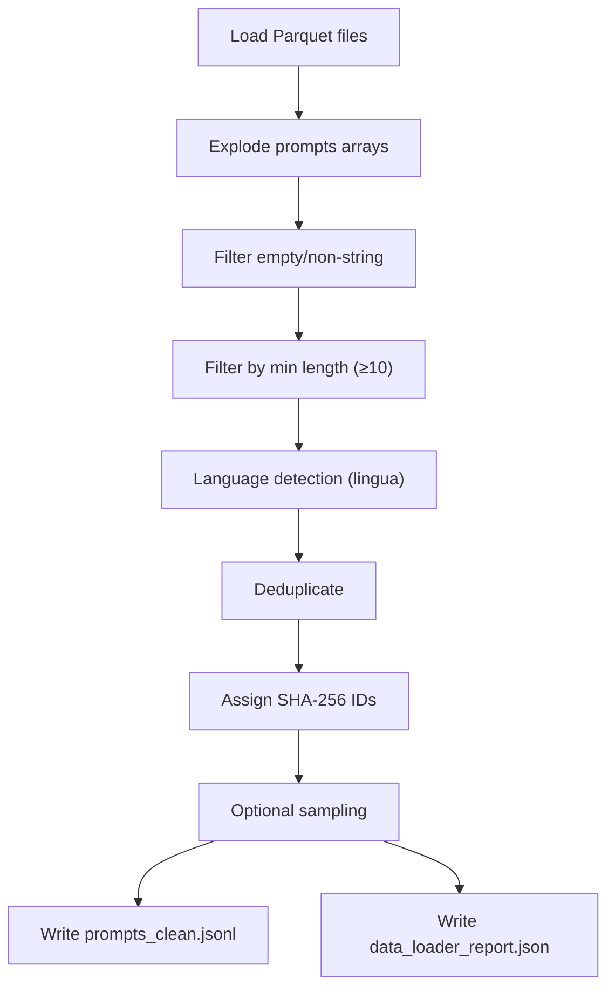

# Data Loader Module, Walkthrough

## What was built

The complete **Data Loader** module (PRD §4.1), the first pipeline stage that cleans and filters the PromptSet dataset into a ready-to-use JSONL file for downstream code generation.

## Files Created

| File | Purpose |
|---|---|
| [pyproject.toml](file:///d:/School/BThesis/LLMSecEvalPipeline/pyproject.toml) | Project manifest with dependencies (optional groups for codegen/sast/dev) |
| [config.yaml](file:///d:/School/BThesis/LLMSecEvalPipeline/config.yaml) | Default pipeline configuration |
| [config.py](file:///d:/School/BThesis/LLMSecEvalPipeline/src/llmseceval/config.py) | Pydantic v2 config models + YAML loader |
| [loader.py](file:///d:/School/BThesis/LLMSecEvalPipeline/src/llmseceval/data_loader/loader.py) | Core data loading/cleaning/filtering pipeline |
| [test_config.py](file:///d:/School/BThesis/LLMSecEvalPipeline/tests/test_config.py) | 14 config validation tests |
| [test_data_loader.py](file:///d:/School/BThesis/LLMSecEvalPipeline/tests/test_data_loader.py) | 19 data loader tests (unit + integration) |
| [create_fixtures.py](file:///d:/School/BThesis/LLMSecEvalPipeline/tests/create_fixtures.py) | Script to generate synthetic test fixture |

## Processing Pipeline



## Key Design Decisions

1. **Lazy lingua import**, The `lingua` library is only imported inside `_filter_by_language()`, not at module level. This allows the module to be imported and tested without the heavy (~170MB) lingua dependency.

2. **Restricted language detector**, Instead of loading all 75+ languages, the detector is built with only 9 languages (EN, ZH, KO, JA, RU, DE, FR, ES, PT) which covers >99% of the non-English content and is significantly faster.

3. **Each step is a testable method**, All processing steps are separate static/instance methods (`_load_parquet`, `_explode_prompts`, `_filter_empty`, etc.) that can be unit-tested independently.

4. **Mocked lingua in tests**, Tests mock `lingua.LanguageDetectorBuilder` at the import source rather than at the loader module level, since it's lazily imported.

## Test Results

```
33 passed in 0.71s

Coverage:
  __init__.py          100%
  config.py            100%
  data_loader/__init__ 100%
  data_loader/loader    90%
  TOTAL                 93%
```

## What's Left

- **Manual verification**: Run on the real dataset with `sample_size: 500` to spot-check output quality
- **Full run**: Process the entire dataset (~58K prompts after dedup, ~49K after English filter)
- **CLI entry point**: `cli.py` and `pipeline.py` are not yet implemented, the loader can currently be run via `python -m llmseceval.data_loader.loader config.yaml`
